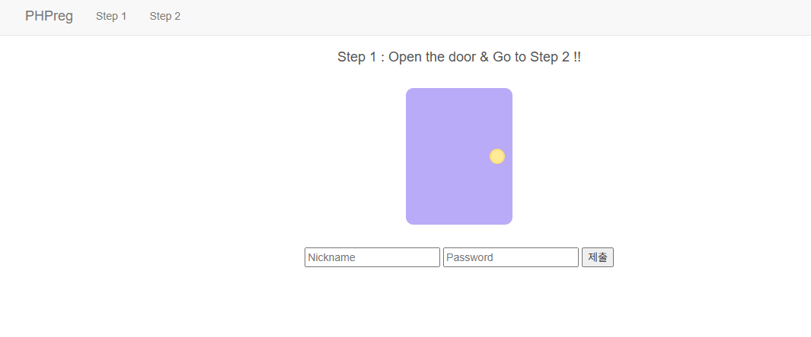
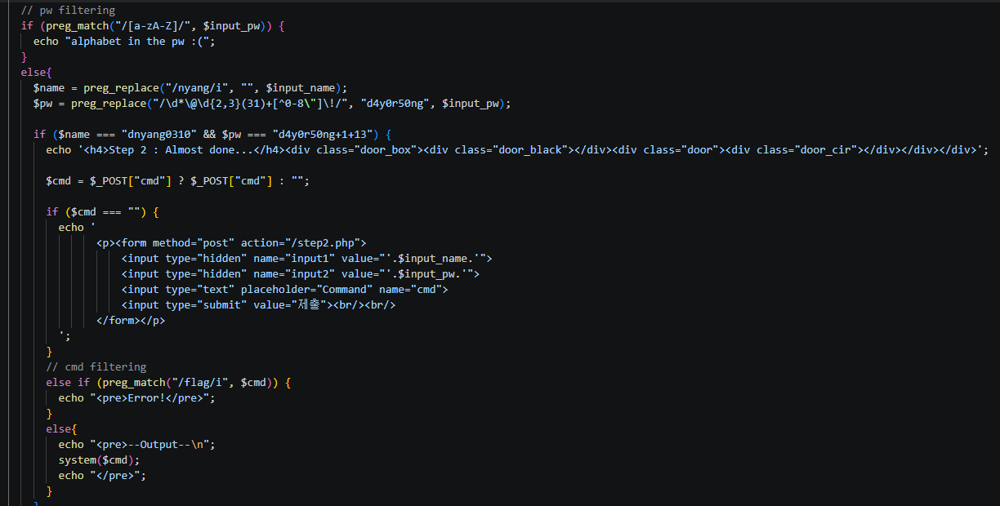
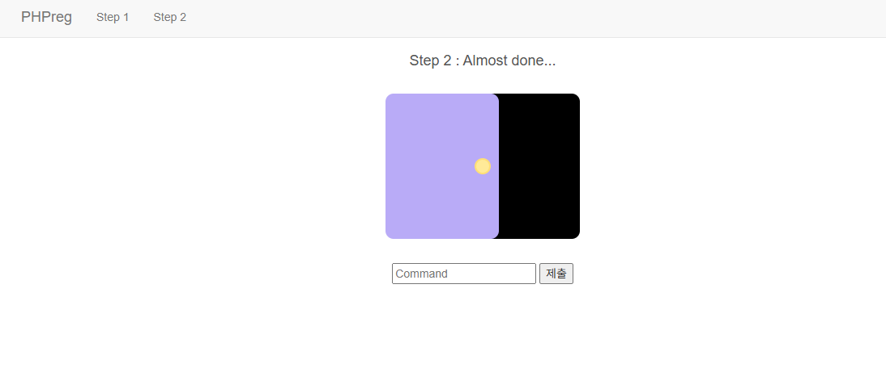
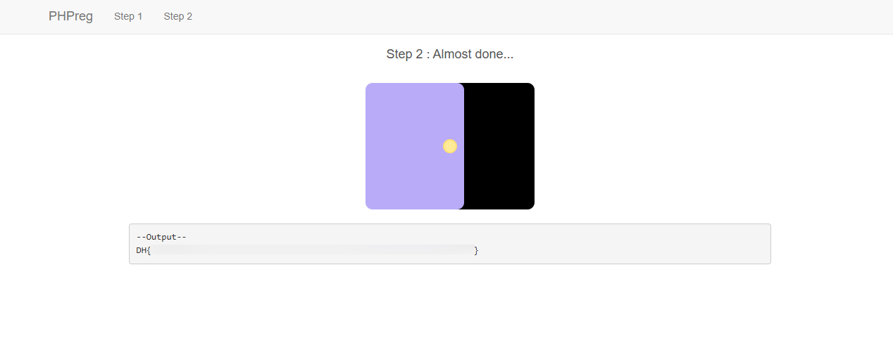

# PHPreg

## 문제 정보
- 플랫폼: Dreamhack
- 분야: 웹해킹
- 난이도: Beginner

## 문제 설명
PHP로 작성된 페이지다.
알맞은 Nickname과 Password를 입력하면 Step 2로 넘어갈 수 있다.
Step 2에서 system() 함수를 이용하여 플래그를 획득할 수 있다.
플래그는 ../dream/flag.txt에 위치한다.

## 풀이 과정
1. 서버에 접속하여 Step 1 메인 화면을 확인한다.

2. step2.php 코드를 분석한다.
   - 비밀번호에 알파벳이 있으면 차단한다.
   - `nyang`을 제거한 name이 `dnyang0310` 이어야 한다.
   - 정규식 변환 후 pw가 `d4y0r50ng+1+13` 이어야 한다.
   - cmd에 `flag` 단어가 있으면 차단한다.
   - 통과하면 `system($cmd)`로 명령어를 실행한다.

3. Nickname과 Password를 분석하여 입력한다.
   - Nickname: `dnyanyangng0310` → nyang 제거 → `dnyang0310`
   - Password: `@12319!+1+13` → 정규식 변환 → `d4y0r50ng+1+13`

4. Step 2 cmd 입력창에서 flag를 획득한다.
   - `flag` 단어 우회: `cat ../dream/fla*` 입력

5. flag를 획득한다.

## 취약점
- 입력값 필터링이 미흡하여 우회가 가능하다.
- `system()` 함수로 서버 명령어를 실행할 수 있다.
- `flag` 단어만 막고 와일드카드(`*`)를 막지 않아 우회 가능하다.

## 배운 점
- `preg_replace`로 문자열을 변환하는 로직을 분석할 수 있다.
- 정규식 패턴을 분석하여 조건을 만족하는 입력값을 만들 수 있다.
- `flag` 필터링은 와일드카드(`*`)로 우회할 수 있다.

## Flag
DH{...}