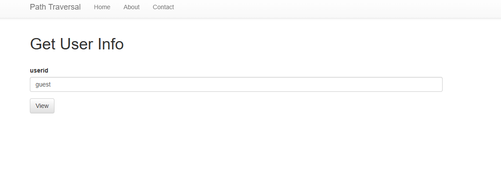
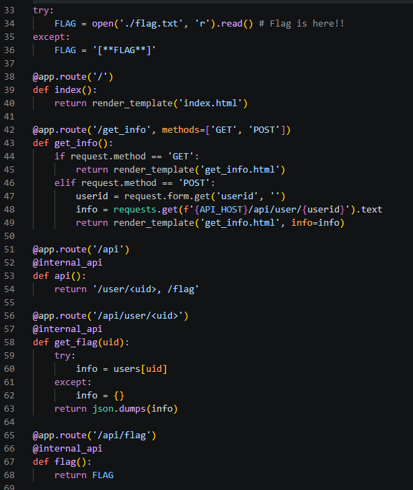
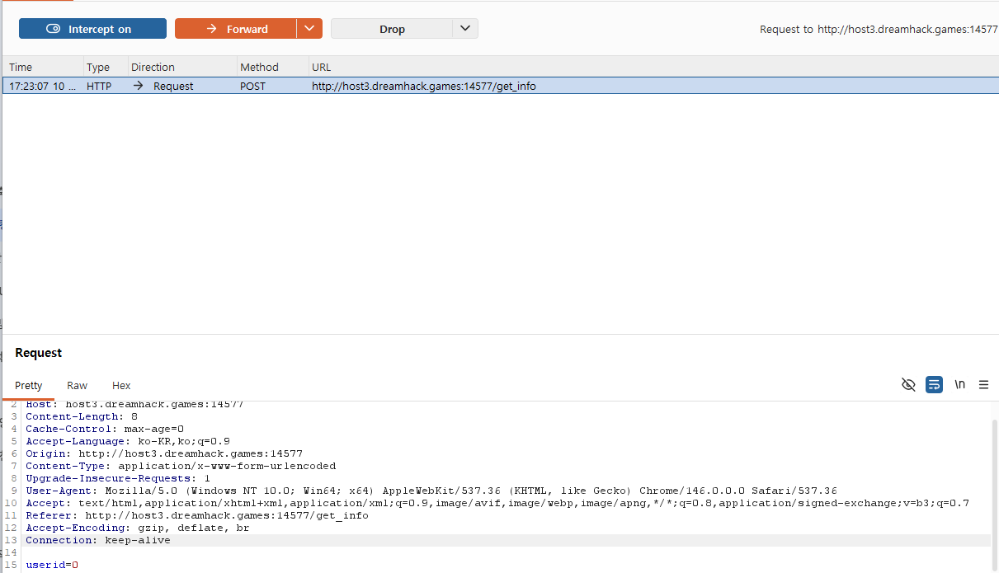
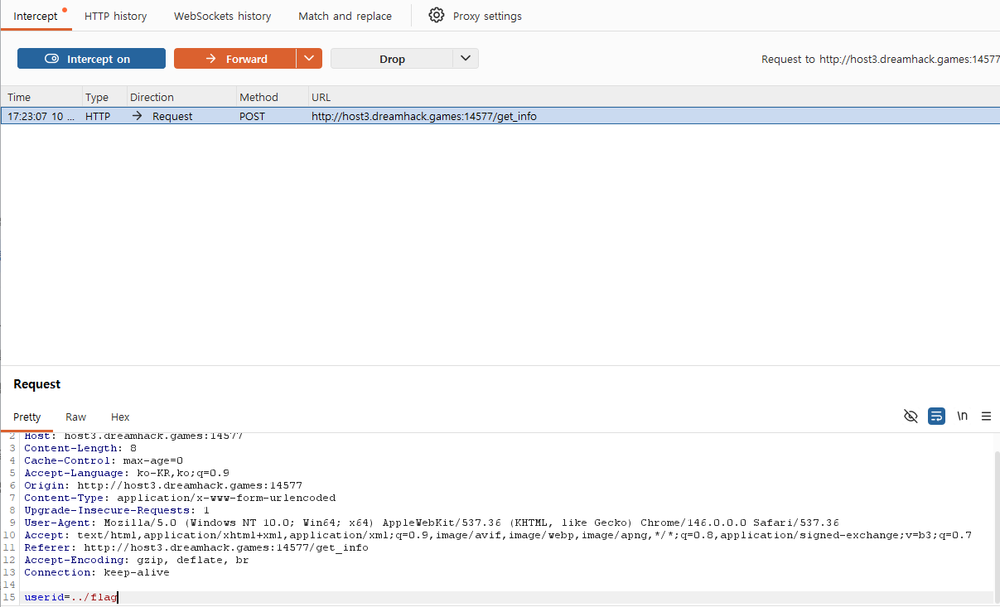
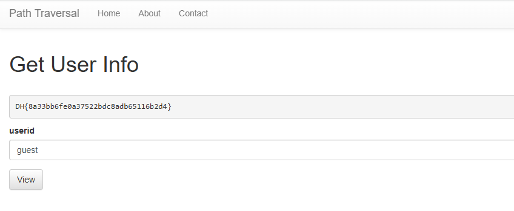

# Path Traversal

## 문제 정보
- **플랫폼**: Dreamhack
- **분야**: 웹해킹 (Web)
- **난이도**: Beginner

## 풀이 과정

1. **문제 접속 및 분석**
   - 유저 정보를 조회하는 `/get_info` 페이지를 확인했다. `userid`를 입력받아 서버 내부 API에 요청을 보내는 구조이다.
   

2. **소스코드 분석 (app.py)**
   - 제공된 `app.py` 소스코드를 분석한 결과, 사용자가 입력한 `userid` 값이 내부 API 호출 주소에 필터링 없이 그대로 삽입되는 취약점을 발견했다.
   - `../` 문자를 주입할 경우, 의도된 `/api/user/` 경로를 벗어나 `/api/flag` 경로에 접근할 수 있는 구조임을 파악했다.
   

3. **취약점 탐색 (프록시 설정)**
   - 일반 브라우저에서 `../flag`를 입력하면 자동 인코딩 기능 때문에 서버가 경로 이동 명령으로 인식하지 못한다. 이를 우회하기 위해 **Burp Suite**의 `Intercept` 기능을 활성화하여 서버로 전송되는 원본 패킷을 가로챘다.
   

4. **패킷 조작 및 전송**
   - 가로챈 패킷의 `userid` 파라미터 값을 강제로 `../flag`로 수정했다. 이렇게 하면 서버 측에서는 `http://127.0.0.1:8000/api/user/../flag`를 호출하게 되며, 최종적으로 `/api/flag`에 접근하게 된다.
   

5. **Flag 획득**
   - 조작된 패킷을 전송(`Forward`)한 결과, 서버가 내부 비밀 경로의 데이터를 반환하여 화면에 플래그가 출력된 것을 확인했다.
   

## 핵심 원리
- **URL Path Traversal**: 상위 디렉토리 이동 문자(`../`)를 처리하는 서버 로직의 허점을 이용해 비인가 파일이나 경로에 접근하는 공격 기법이다.
- **Proxy Tool (Burp Suite) 활용**: 브라우저의 보호 기능(인코딩 등)을 우회하여 서버에 날것(Raw)의 데이터를 전달함으로써 보안 필터링을 무력화할 수 있다.

## Flag
`DH{...}`