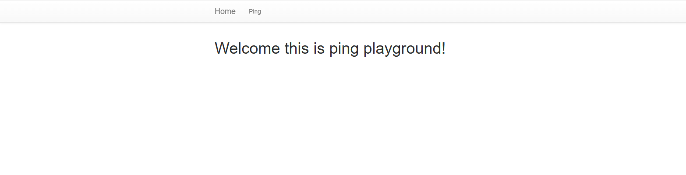
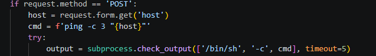
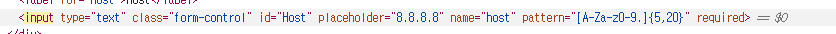
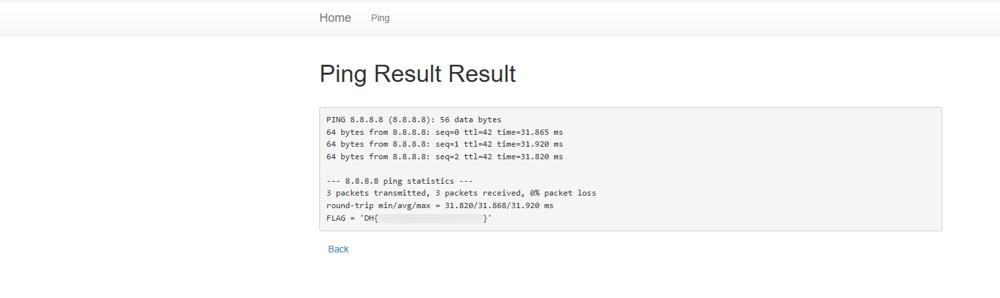

# command-injection-1

## 문제 정보
- 플랫폼: Dreamhack
- 분야: 웹해킹
- 난이도: Beginner

## 문제 설명
특정 Host에 ping 패킷을 보내는 서비스다.
Command Injection을 통해 플래그를 획득할 수 있다.
플래그는 flag.py에 있다.

## 풀이 과정
1. 서버에 접속하여 ping 서비스를 확인한다.

2. app.py 코드를 분석한다.
   - 입력값을 검증 없이 명령어에 그대로 사용한다.
   - `cmd = f'ping -c 3 "{host}"'` 형태로 실행된다.

3. F12 → Elements 탭에서 input 태그의 pattern 속성을 제거한다.

4. 입력창에 `8.8.8.8"; cat flag.py #`를 입력하여 flag를 획득한다.
   - 실제 실행되는 명령어: `ping -c 3 "8.8.8.8"; cat flag.py #"`
   - `#` 으로 뒤의 따옴표를 주석 처리한다.

## 취약점
사용자 입력값을 검증 없이 시스템 명령어에 직접 사용한다.
`;` 를 이용해 추가 명령어를 실행할 수 있다.

## 배운 점
- 사용자 입력값은 반드시 검증 후 명령어에 사용해야 한다.
- 브라우저 검증(pattern)은 개발자 도구로 우회할 수 있다.
- `;` 는 리눅스에서 명령어 구분자로 사용된다.
- `#` 은 리눅스에서 주석 처리로 뒤의 내용을 무시한다.

## Flag
DH{...}
