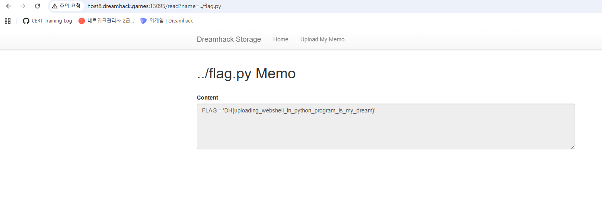
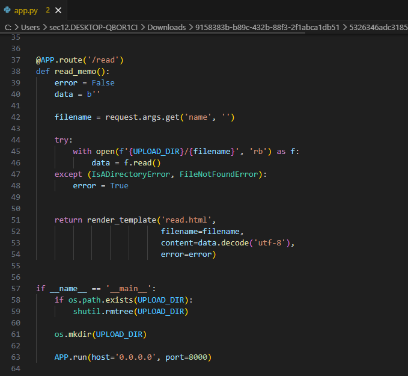
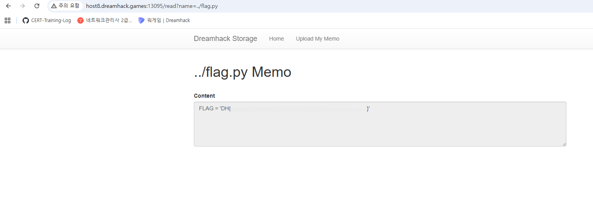

# file-download-1

## 문제 정보
- 플랫폼: Dreamhack
- 분야: 웹해킹
- 난이도: Beginner

## 문제 설명
File Download 취약점이 존재하는 웹 서비스다.
flag.py를 다운로드 받으면 플래그를 획득할 수 있다.

## 풀이 과정
1. 서버에 접속하여 메모 업로드 서비스를 확인한다.

2. app.py 코드를 분석한다.
   - 업로드(/upload)할 때만 `..` 를 검사한다.
   - 읽기(/read)할 때는 검증이 없다.

3. read 엔드포인트에 경로 조작으로 flag.py를 요청한다.
   - URL: `/read?name=../flag.py`

## 취약점
read 함수에서 filename 입력값 검증이 없다.
경로 조작(Path Traversal)으로 상위 폴더의 파일에 접근할 수 있다.

## 배운 점
- 파일 읽기/쓰기 모든 곳에서 경로 검증이 필요하다.
- `..` 는 상위 디렉토리를 의미한다.
- 업로드만 막고 읽기를 안 막으면 취약점이 발생한다.

## Flag
DH{...}
