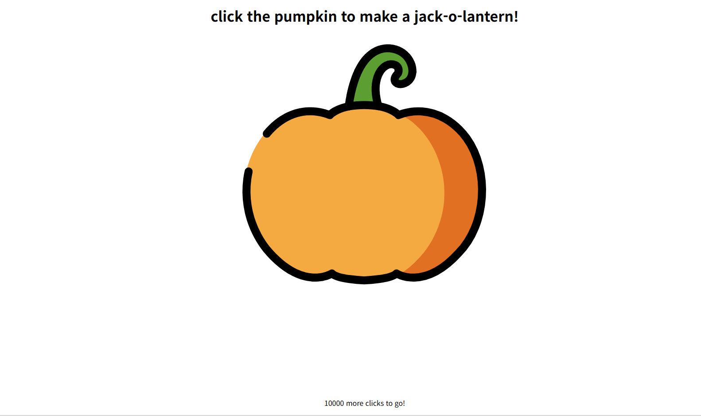
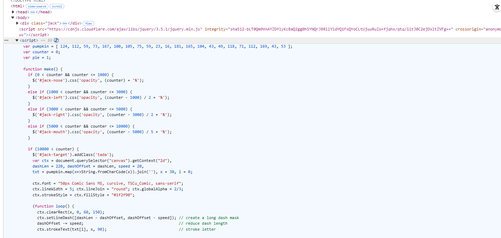
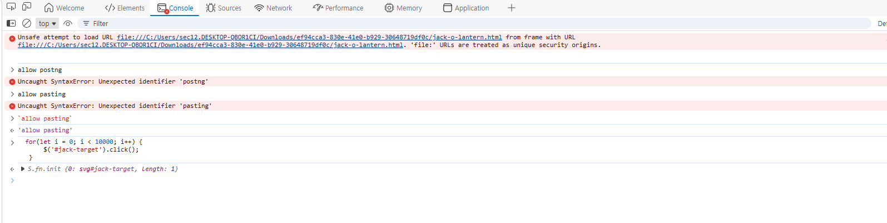
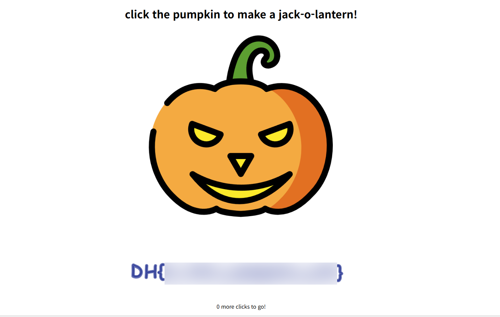

# jack-o-lantern

## 문제 정보
- 플랫폼: Dreamhack
- 분야: 웹해킹
- 난이도: Beginner

## 문제 설명
할로윈 파티를 기념하기 위해 호박을 준비했다.
호박을 10000번 클릭하면 플래그를 획득할 수 있다.

## 풀이 과정
1. 문제 파일을 다운로드 후 열어 메인 화면을 확인한다.


2. F12 → Elements에서 소스코드를 분석한다.
   - pumpkin 배열에 암호화된 값이 있다.
   - 100번 클릭마다 XOR 연산으로 배열이 변환된다.
   - 10000번 클릭 시 flag가 출력된다.


3. F12 → Console에서 `allow pasting` 직접 타이핑 후 엔터한다.

4. Console에 아래 코드를 붙여넣어 자동으로 10000번 클릭한다.
```javascript
   for(let i = 0; i < 10000; i++) {
       $('#jack-target').click();
   }
```


5. flag를 획득한다.


## 취약점
클라이언트 사이드에서 flag를 검증한다.
소스코드가 노출되어 있어 로직을 분석하고 우회할 수 있다.

## 배운 점
- 클라이언트 사이드에서 flag를 검증하면 안 된다.
- 소스코드가 노출된 경우 로직을 분석해 우회할 수 있다.
- Console에서 클릭 이벤트를 자동화할 수 있다.

## Flag
DH{...}