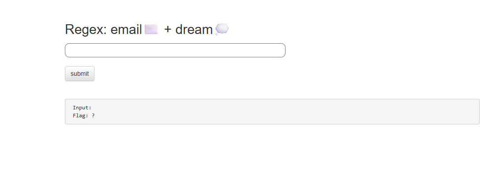
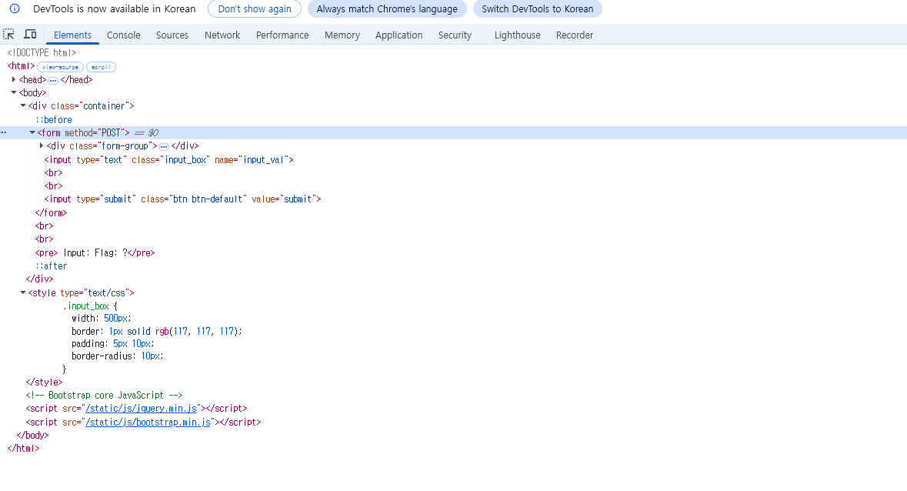
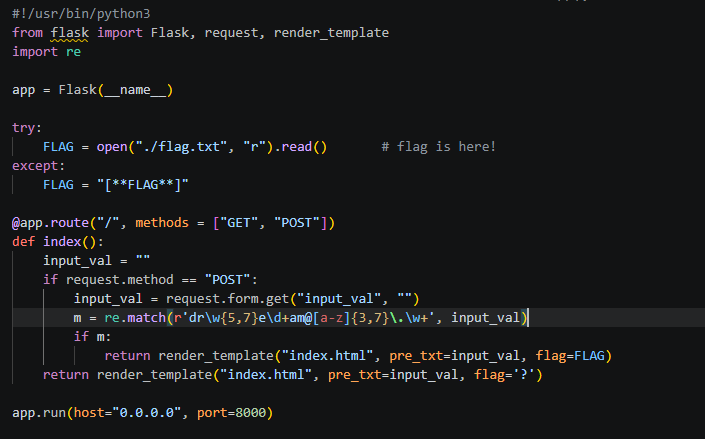
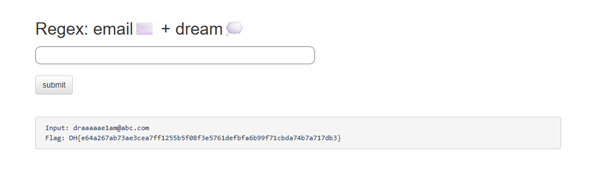

# Regex: email + dream

## 문제 정보
- **플랫폼**: Dreamhack
- **분야**: 웹해킹 (Web)
- **난이도**: Beginner

## 문제 설명
제시된 정규표현식(Regular Expression) 규칙을 만족하는 문자열을 입력하여 플래그를 획득하는 문제이다. 서버 측 파이썬 코드(`app.py`)의 정규표현식 검증을 통과해야 플래그를 얻을 수 있다.

## 풀이 과정
1. **문제 접속 및 힌트 확인**
   - 메인 화면에서 "Regex: email✉️ + dream💭" 문구와 입력창을 확인한다.
   

2. **소스코드 분석 (Elements)**
   - F12 개발자 도구의 **Elements** 탭에서 HTML 구조를 분석한 결과, 클라이언트 측에는 별도의 `pattern` 속성이나 검증 스크립트가 존재하지 않음을 확인했다.
   

3. **서버 측 정규표현식 분석 (app.py)**
   - 제공된 `app.py` 소스코드에서 실제 검증에 사용되는 정규표현식 패턴을 찾아 분석한다.
   - **패턴**: `r'dr\w{5,7}e\d+am@[a-z]{3,7}\.\w+'`
   

   | 메타 문자 | 의미 | 적용 예시 |
   | :--- | :--- | :--- |
   | `dr` | "dr"로 시작 | `dr` |
   | `\w{5,7}` | 영문/숫자/언더바 5~7글자 | `aaaaa` |
   | `e` | 문자 "e" 포함 | `e` |
   | `\d+` | 숫자 1개 이상 | `1` |
   | `am` | 문자 "am" 포함 | `am` |
   | `@` | "@" 기호 포함 | `@` |
   | `[a-z]{3,7}` | 소문자 3~7글자 | `abc` |
   | `\.` | 마침표(".") 포함 | `.` |
   | `\w+` | 영문/숫자 1개 이상 | `com` |

4. **Flag 획득**
   - 분석한 규칙을 조합하여 만든 페이로드(`draaaaae1am@abc.com`)를 입력창에 제출하고 플래그를 확인한다.
   

## 취약점 및 핵심 원리
- **정규표현식 검증 로직**: 특정 패턴을 강제하는 정규표현식이 서버에 설정되어 있을 때, 해당 규칙을 역으로 분석하여 유효한 입력값을 생성할 수 있다.
- **화이트박스 분석**: 서버 소스코드가 공개된 경우, 개발자가 의도한 데이터 형식을 완벽하게 파악하여 보안 검증을 우회하거나 통과할 수 있다.

## 배운 점
- 파이썬 `re.match()` 함수가 문자열의 시작부분부터 패턴을 대조한다는 것을 이해했다.
- 다양한 정규표현식 메타 문자(`\w`, `\d`, `{n,m}`)의 사용법을 복습했다.
- 클라이언트 측 검증이 없을 때 서버 측 소스코드를 통해 로직을 파악하는 과정의 중요성을 느꼈다.

## Flag
`DH{...}`
